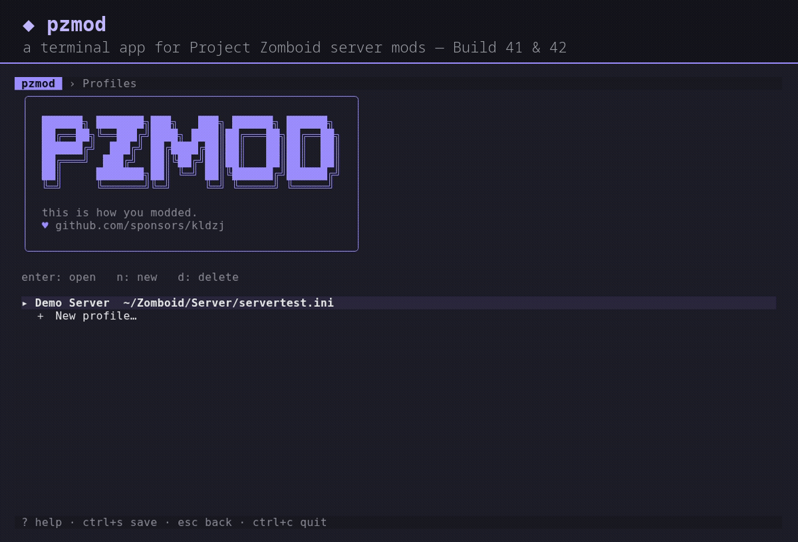
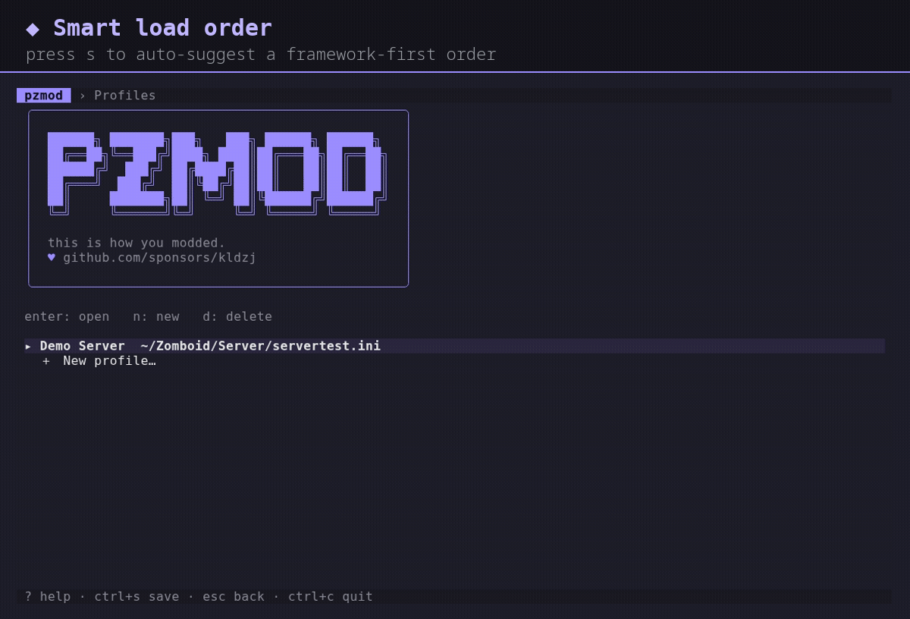
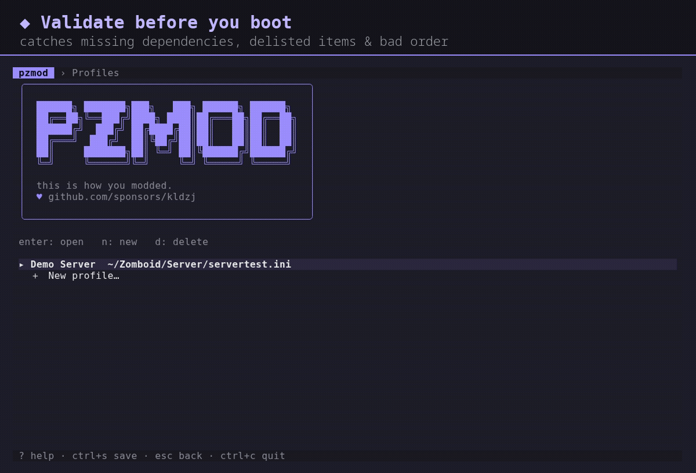

<div align="center">

# pzmod

**Project Zomboid dedicated-server mod manager** · _this is how you modded._



[](https://github.com/kldzj/pzmod/releases)
[](https://github.com/kldzj/pzmod/actions/workflows/test.yml)
[](LICENSE)
[](https://github.com/sponsors/kldzj)

</div>

**pzmod** is a keyboard-driven terminal app (plus a scriptable CLI) for managing
the mods on a Project Zomboid dedicated server. It browses the Steam Workshop,
resolves dependencies, orders your mods, validates everything before you boot the
server, and keeps timestamped backups, all while preserving your
`servertest.ini` byte-for-byte.

## Features

- **Terminal app**: browse and manage everything from a fast, keyboard-driven UI
- **Workshop search & browse**: find mods and add them without copying IDs
- **Dependency auto-resolution**: pull in required items (and their deps) for you
- **Load-order management**: reorder mods and get a framework-first suggestion
- **Type-to-filter**: press `/` on any long list to filter instantly
- **Dry-run validation**: catch missing deps, unknown mod IDs, delisted items, and bad map order before launch
- **Backups & rollback**: every save snapshots the config; restore in one step
- **Multiple server profiles**: manage several configs from one place
- **Build 41 / Build 42 awareness**: per-profile build with compatibility hints
- **Byte-exact config edits**: comments, ordering, and line endings are preserved

## Demo

Each clip is captioned with what it does. Filter a long list, get a load-order
suggestion, validate before you boot, and snapshot every save:

|  |  |
| --- | --- |
|  |  |
|  |  |

## Install

### Linux & macOS

```bash
curl -fsSL https://pzmod.dev/install.sh | bash
```

Installs the latest release to `/usr/local/bin` (Intel and Apple Silicon), with the
download checksum-verified. Pass a custom path with `| bash -s -- ~/.local/bin/pzmod`.

Prefer to read the script first?

```bash
curl -fsSL https://pzmod.dev/install.sh -o install.sh
less install.sh
bash install.sh        # optional: bash install.sh ~/.local/bin/pzmod
```

### Windows (PowerShell)

```powershell
irm https://pzmod.dev/install.ps1 | iex
```

Installs to `%LOCALAPPDATA%\pzmod` and adds it to your user PATH.

### Docker

A minimal multi-arch image (amd64/arm64) is published to the GitHub Container Registry:

```bash
docker run --rm -it \
  -e PZMOD_STEAM_KEY=<key> \
  -v "$PWD:/data" \
  ghcr.io/kldzj/pzmod --file /data/servertest.ini validate
```

Pass your Steam key with `PZMOD_STEAM_KEY` and mount your config in. Add
`-v pzmod:/config` to persist profiles and backups across runs.

### Manual

Download a binary from the [releases page](https://github.com/kldzj/pzmod/releases).

## Usage

```bash
# Launch the interactive terminal app (profile picker)
pzmod

# Open a specific config directly
pzmod --file path/to/servertest.ini

# Scriptable subcommands (use --file or --profile, or the default profile)
pzmod profile add --name "My Server" --file path/to/servertest.ini --build b41
pzmod set name "My Server"
pzmod get list
pzmod search hydrocraft
pzmod mods add 2392709985 --resolve-deps
pzmod validate              # exits non-zero on errors (CI-friendly)
pzmod backup list

# Add --json to any command for machine-readable output
pzmod mods list --json | jq '.mods'
```

Run `pzmod --help` for the full command list.

With `--json`, any command prints its result as JSON on stdout; errors print
as `{"error":"..."}` to stderr and the exit code is preserved, so scripts can
read stdout and gate on the exit code.

## Requirements

- A Steam Web API key ([get one here](https://steamcommunity.com/dev/apikey))
- A Project Zomboid server install (or at least a `servertest.ini`)

## Support

pzmod is free and open source. If it saves you time running your server,
please consider [**sponsoring its development on GitHub**](https://github.com/sponsors/kldzj).
It directly funds new features and maintenance. ♥

## Upgrading from v2

Config now lives in `~/.config/pzmod` (`%AppData%\pzmod` on Windows). Your
existing `~/.pzmod` API key is migrated automatically on first run. The old
`--file` flag and the `get`/`set`/`copy`/`api-key`/`update` commands still work
as before.
